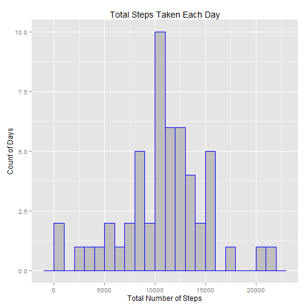
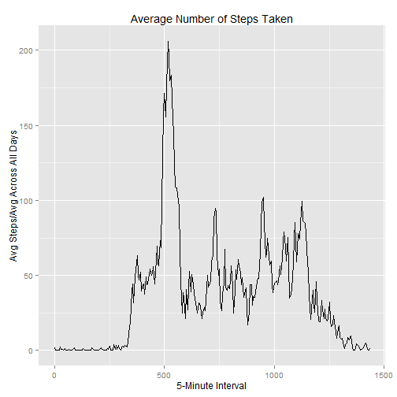
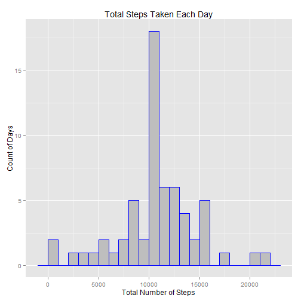
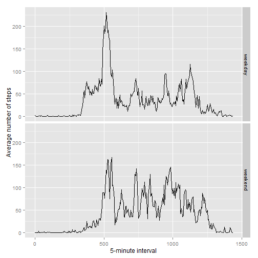

**Peer Assessment 1**
===================

This assignment makes use of data from a personal activity monitoring device. This device collects data at 5 minute intervals through out the day. The data consists of two months of data from an anonymous individual collected during the months of October and November, 2012 and include the number of steps taken in 5 minute intervals each day.

**Chronology of Analysis**

* Loading and preprocessing the data
* What is mean total number of steps taken per day?
* What is the average daily activity pattern?
* Imputing missing values
* Are there differences in activity patterns between weekdays and weekends?


##Loading and preprocessing the data
* Read Data From activity.csv renamed activityrepresproj1.csv
* Date downloaded: "Thu Mar 05 12:06:48 2015"


```r
datadf <- read.csv("C:/Users/Mike/Desktop/Coursera/activityrepresproj1.csv")
```

Description of datadf(names, summary, str)

names(datadf)
[1] "steps"    "date"     "interval"

str(datadf)
'data.frame':        17568 obs. of  3 variables:
 $ steps   : int  NA NA NA NA NA NA NA NA NA NA ...
 $ date    : Factor w/ 61 levels "2012-10-01","2012-10-02",..: 1 1 1 1 1 1 1 1 1 1 ...
 $ interval: int  0 5 10 15 20 25 30 35 40 45 ...

summary(datadf)
steps                date          interval     
Min.   :  0.00   2012-10-01:  288   Min.   :   0.0  
1st Qu.:  0.00   2012-10-02:  288   1st Qu.: 588.8  
Median :  0.00   2012-10-03:  288   Median :1177.5  
Mean   : 37.38   2012-10-04:  288   Mean   :1177.5  
3rd Qu.: 12.00   2012-10-05:  288   3rd Qu.:1766.2  
Max.   :806.00   2012-10-06:  288   Max.   :2355.0  
NA's   :2304     (Other)   :15840   

dates in dataset: 2012-10-01 thru 2012-11-30

*Make a file without NAs*


```r
datadfnona <- datadf[complete.cases(datadf),];View(datadfnona)## result: 15,264rows 3var
```

##What is mean total number of steps taken per day?

1. Summarize the number of steps per day(ignoring NAs)


```r
library(plyr)
library(dplyr)
stepsperday <- summarise(group_by(datadfnona, date),
        sumstepsday = sum(steps))## result 53rows 2var
```

2. Create a histogram of total number of steps taken each day(sumstepsday)


```r
library(ggplot2)
ggplot(stepsperday, aes(x=sumstepsday)) + geom_histogram(binwidth = 1000, color="blue",
fill="grey")+ labs(title="Total Steps Taken Each Day", x="Total Number of Steps",
y="Count of Days")
```

 

3. Calculate the mean/median of the total number of steps taken per day


```r
mean(stepsperday$sumstepsday)
```

```
## [1] 10766.19
```

```r
median(stepsperday$sumstepsday)
```

```
## [1] 10765
```

##What is the average daily activity pattern?

1. Make time series of 5 minute intervals(x) vs avg num steps/avg across all days(y)

Group by intervals


```r
groupinterval <- summarise(group_by(datadfnona, interval),
        medstepsinterval = mean(steps));View(groupinterval)## result 268rows 2var
```

Add equal intervals


```r
groupinterval$sequentialperiod <- seq(0, 1435, by = 5)
```


```r
ggplot(groupinterval, aes(x=sequentialperiod, y=medstepsinterval)) + geom_line()+
labs(title="Average Number of Steps Taken", x="5-Minute Interval",
y="Avg Steps/Avg Across All Days")
```

 

2. Which 5-min interval, on avg across all days, contains the max num steps?

Sort by steps, bringing max avg steps to top interval result max: interval 835


```r
sortbysteps <- groupinterval[with(groupinterval, order(-medstepsinterval)),]
head(sortbysteps)
```

```
## Source: local data frame [6 x 3]
## 
##   interval medstepsinterval sequentialperiod
## 1      835         206.1698              515
## 2      840         195.9245              520
## 3      850         183.3962              530
## 4      845         179.5660              525
## 5      830         177.3019              510
## 6      820         171.1509              500
```

##Imputing missing values

1. Calculate total number of missing values Result: 2,304 NAs


```r
sum(is.na(datadf$steps))
```

```
## [1] 2304
```

2. Devise strategy to replace NAs

Aggregate steps by respective interval using mean steps per interval


```r
grpintvlall <- aggregate(steps ~ interval, datadf, mean, na.rm = TRUE)
```

3. Create new dataset: mean intervals calculated above into NAs of original data(datadf)


```r
datanafilled <- adply(datadf, 1, function(x) if (is.na(x$steps)) {
        x$steps = round(grpintvlall[grpintvlall$interval == x$interval, 2])
        x
} else {
        x
})
```

4. Make a histogram of total number of steps taken each day and mean/median of total steps

Calulate total steps taken of datanafilled  result: 17,568rows 3var


```r
datadfnonafilled <- datanafilled[complete.cases(datanafilled),];View(datadfnonafilled)
```

Summarize the number of steps per day result: 61rows 2var


```r
stepsperdayfilled <- summarise(group_by(datadfnonafilled, date),
                         sumstepsday = sum(steps));View(stepsperdayfilled)
```

Generate histogram


```r
ggplot(stepsperdayfilled, aes(x=sumstepsday)) + geom_histogram(binwidth = 1000, color="blue",
fill="grey")+ labs(title="Total Steps Taken Each Day", x="Total Number of Steps",
y="Count of Days")
```

 

Calculate the mean/median


```r
mean(stepsperdayfilled$sumstepsday)
```

```
## [1] 10765.64
```


```r
median(stepsperdayfilled$sumstepsday)
```

```
## [1] 10762
```

**What is the impact on imputing missing data on the estimates of the total daily steps?**

There does not apprear to be much change in total steps per day when looking at the mean
and median values.  Plotting with the same 1,000 steps/bin as the original shows some increase
around 10,000 steps.

##Are there differences in activity patterns between weekdays and weekends?

1. Add a day col and create new weekday/weekend factors


```r
stepsperdaywewd <- datadfnonafilled;View(stepsperdaywewd)
stepsperdaywewd$date <- as.Date(stepsperdaywewd$date)
stepsperdaywewd$day <- weekdays(as.Date(stepsperdaywewd$date))
```

Subset weekdays and weekends


```r
weekends <- subset(stepsperdaywewd, day %in% c("Saturday", "Sunday"))
weekdays <- subset(stepsperdaywewd, day %in% c("Monday", "Tuesday", "Wednesday","Thursday","Friday"));View(weekdays)
```

Get mean steps for weekday/weekend


```r
wkendsintmnstps <- aggregate(steps ~ interval, weekends, mean)
wkdaysintmnstps <- aggregate(steps ~ interval, weekdays, mean)
```

Add day back in/add equal intervals


```r
wkendsintmnstps1 <- mutate(wkendsintmnstps, day = "weekend")
wkendsintmnstps1$sequentialperiod <- seq(0, 1435, by = 5)
wkdaysintmnstps1 <- mutate(wkdaysintmnstps, day = "weekday")
wkdaysintmnstps1$sequentialperiod <- seq(0, 1435, by = 5)
```

rbind and add level


```r
combwkwkend <- rbind(wkendsintmnstps1,wkdaysintmnstps1)
```

Build panel plots weekends and weekdays


```r
ggplot(combwkwkend, aes(x = sequentialperiod, y = steps)) + geom_line() + facet_grid(day ~.)+
labs(x = "5-minute interval", y = "Average number of steps")
```

 

**Add Commentary on Weekend vs Weekday**

On weekdays there is a spike in activity, with respect to average number of steps, 
at about the 500 5-minute interval and lower 5-minute intervals throughout the day.  
On weekends the activity level intervals are somewhat consistently higher in the over 
half of intervals observed.
